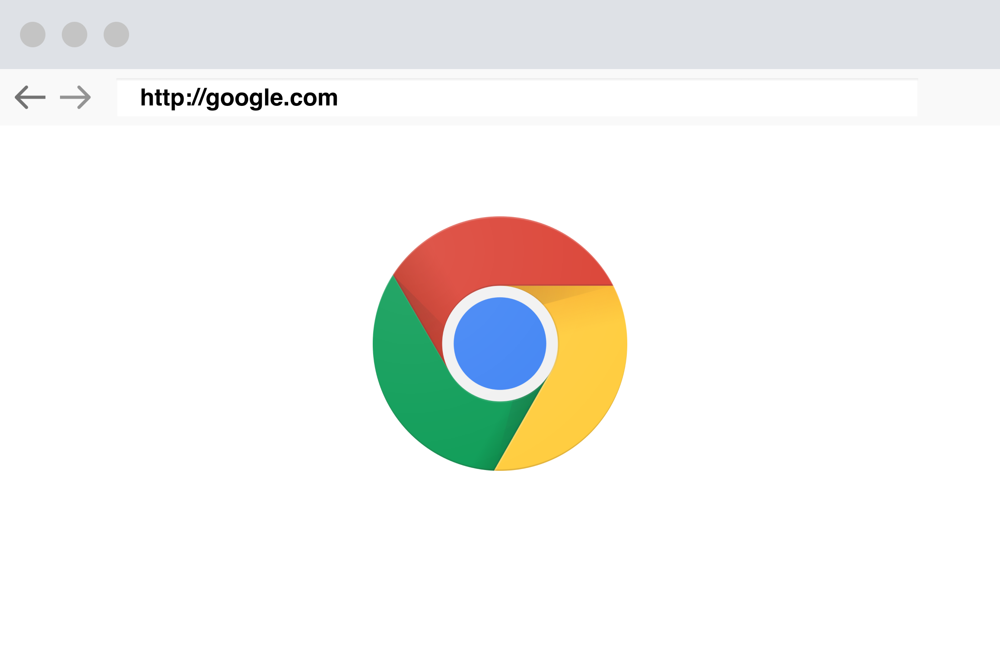

# Node.js

### What is Node.js?

Node is a JavaScript runtime environment that includes everything you need to excecute a program written in JavaScript.

Node was invented for solving an specific problem "using JavaScript outside the browser".

Internally, Google Chrome uses an engine called v8.



v8 is an engine which help us to convert JavaScript into machine code.


### Node.js installation

Go to https://nodejs.org/en/ and install the latest version

### REPL (Read Eval Print Loop)
Once you installed Node.js, it comes with an interactive shell. Go to your terminal and type `node`

```shell
node
>
```

Here is where you can play with Node.js and JavaScript.

```shell
> 1 + 1
2
> 'React School'
'React School'
> const sum = (a, b) => a + b
undefined
>
```

Try to type `.help`, you will see something like:

```shell
.break    Sometimes you get stuck, this gets you out
.clear    Alias for .break
.editor   Enter editor mode
.exit     Exit the repl
.help     Print this help message
.load     Load JS from a file into the REPL session
.save     Save all evaluated commands in this REPL session to a file
```

## Global object
Normally in an JavaScript runtime enviroment exist something called Global Object, which is an object that will be consider when we declare global scope variables. It has already some modules we can use righ out the box.

type `global` in the termina and see what familiar for you.
