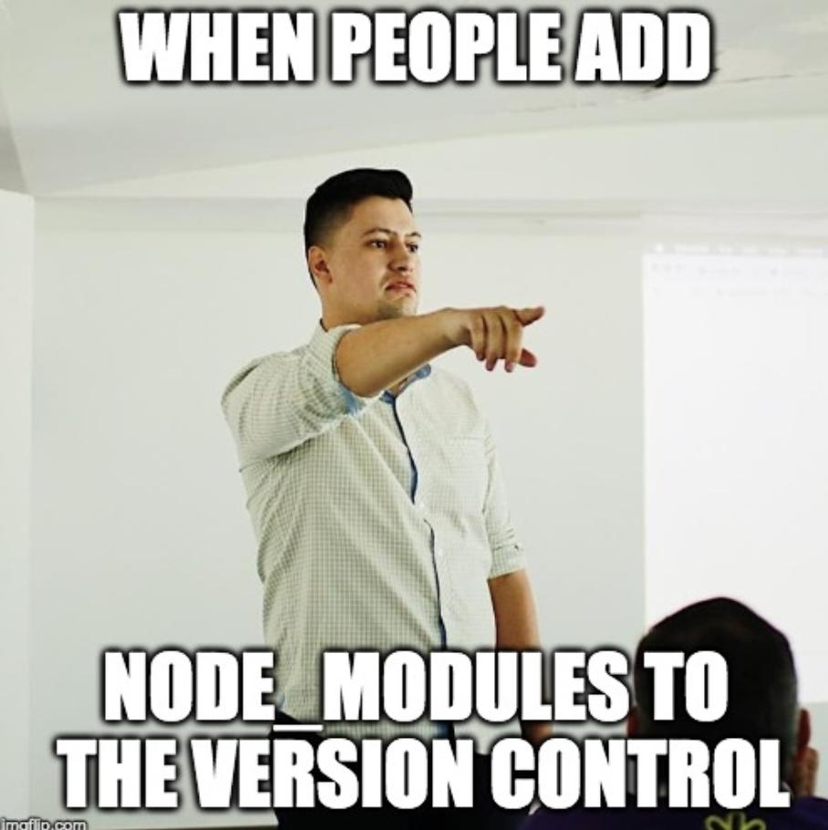

# NPM
There are libraries built by the awesome community which will solve most of your generic problems. npm (Node package manager) has packages you can use in your apps to make your development faster and efficient.

### require(id)
Used to import modules, JSON and local files. Modules can be imported from node_modules. Local modules and JSON files can be imported using a relative path

```
// Importing a local module:
const myLocalModule = require('./path/myLocalModule');

// Importing a JSON file:
const jsonData = require('./path/filename.json');

// Importing a module from node_modules or Node.js built-in module:
const crypto = require('crypto');
```

### package.json

* lists the packages your project depends on
* specifies versions of a package that your project can use using semantic versioning rules
* makes your build reproducible, and therefore easier to share with other developers



##### Useful commands

`npm init`
`npm install`
`npm uninstall`
`npm run COMMAND`
