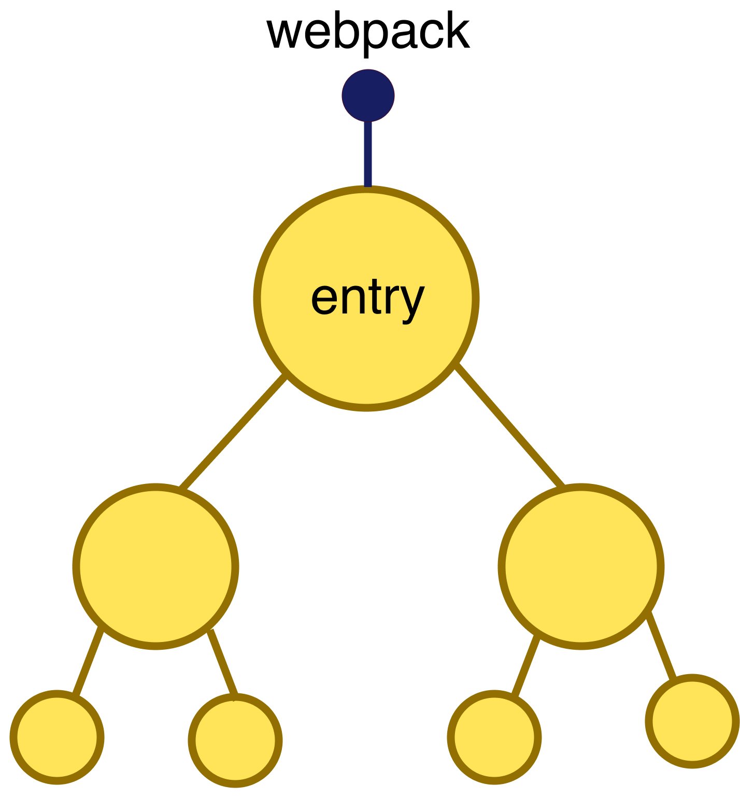
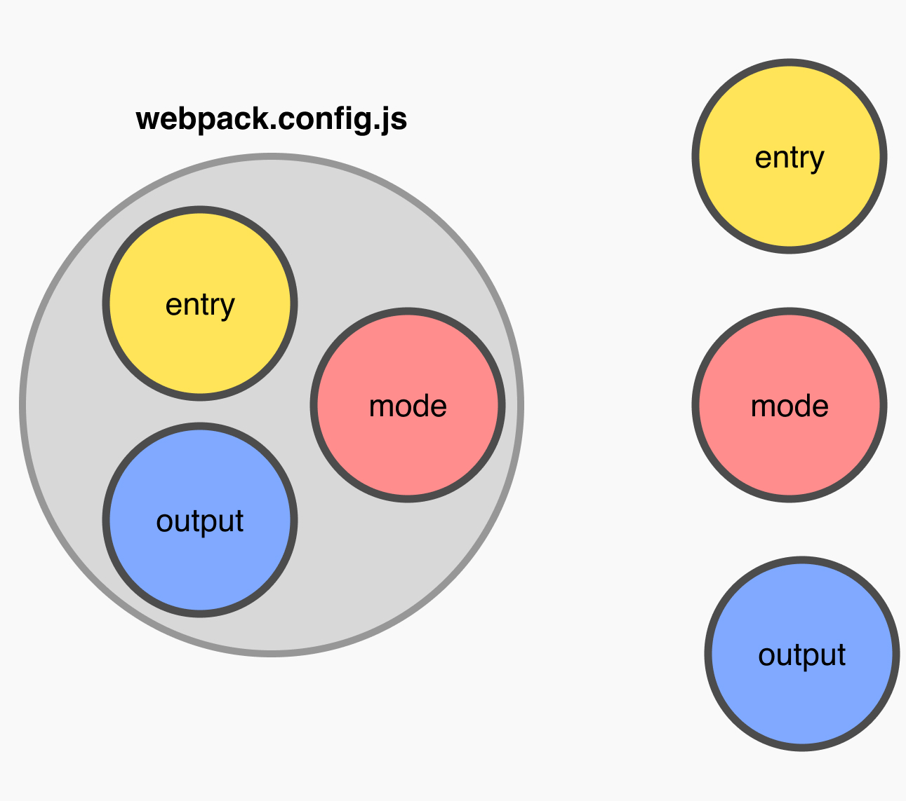
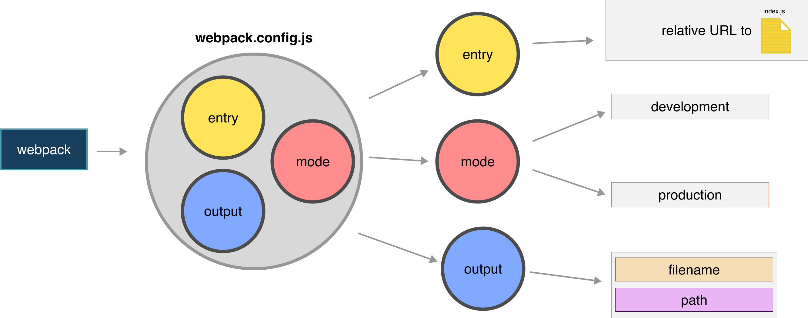

### Webpack

Webpack is a static module bundler for modern JavaScript applications. When webpack processes your application, it internally builds a dependency graph which maps every module your project needs and generates one or more bundles.

I'll put it this way, imagine you have an app that uses all this files in order to run your app correctly:

```
index.js
components/home.js
components/about.js
components/contact.js
components/team.js
components/services.js
components/map.js
styles/styles.scss
styles/home.scss
styles/home.scss
styles/about.scss
styles/contact.scss
styles/team.scss
styles/services.scss
styles/map.scss
```

then you should have to include them all in your app, one by one. With webpack it allows us to create a unique file in order to simplify this process. Webpack creates this `bundle.js` (or whatever name you want) with all the modules available for us.



Everything sounds like magic, but we as the magicians need to do something in order make it happen, and that `something` is a `webpack.config.js`

# webpack.config.js

This file is what tells webpack how to build out ***bundle.js***. A basic configuration has three main components.

1 - entry
2 - output
3 - mode

The complete schema would be something like this:



A basic `webpack.config.js` would look like this:

```
const path = require('path');

module.exports = {
  entry: './src/index.js',
  output: {
    filename: 'main.js',
    path: path.resolve(__dirname, 'dist')
  }
};

```

*Notice that we are not using the `mode` anywhere, it's is not needed, by default it is `development`*

## entry

This is the entry file for the whole configuration, webpack will take this entry and start creating our bundle.

## output

After webpack process all our nested modules, an output file will be generated, this property need two things:

1 - filename
2 - path (it needs to be an absolute path, that's way we need the `path` library)

## mode

By setting the mode parameter to either development, production or none, you can enable webpack's built-in optimizations that correspond to each environment. The default value is production.

# Install webpack

Run `npm install --save-dev webpack` in order to install webpack locally. Also we will need a `CLI` in order to run commands like `webpack` in our terminal. So we will install `webpack-cli` with `npm install --save-dev webpack-cli`.

Create a custom script in your `package.json` in order to create your bundle manually.

```
#package.json

{
  "scripts": {
    "webpack": "webpack --progress",
  }
}
```

in your terminal now you can run something like `npm run webpack`

Review:


