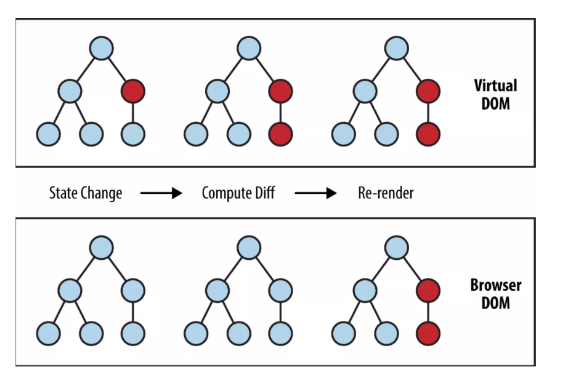

# React for First Times

React is a JavaScript library for building user interfaces


## Start up

It hooks into an html element, this element will be the root of the application

_index.js_

```js
import React from "react";
import ReactDOM from "react-dom";
import "./index.css";
import App from "./App";

ReactDOM.render(<App />, document.getElementById("root"));
```

_index.html_

```html
<html>
  <body id="root">
    <!-- Our React app will live here -->
  </body>
</html>
```

## Virtual DOM

It's a Virtual representation of the actual DOM.

- it's way faster
- cost less to build and destroy
- diffs between prev DOM and current DOM
- Finds the best possible way to update the actual DOM



## Declarative vs Imperative

**Declarative programming** is a programming paradigm … that expresses the logic of a computation without describing its control flow.

**Imperative programming** is a programming paradigm that uses statements that change a program’s state.

_Declaration of statements and keeping track of state for computation results_

```js
var numberList = [1, 2, 3, 4, 5];
var plusOneList = [];

for (let i = 0; i < numberList.length; i++) {
  plusOneList.push(numberList[i] + 1);
}
```

_No control flow is exposed, only needed computation logic_

```js
const plusOneList2 = numberList.map(num => num + 1);
```

## Component Based

They are the building blocks of React
They are: Reusable, Composable and Configurable like functions

_Components in React are Functions_

All components return a React element that describes how a section of the UI should appear.

These React Elements are built with **JSX**

## Our first Component
