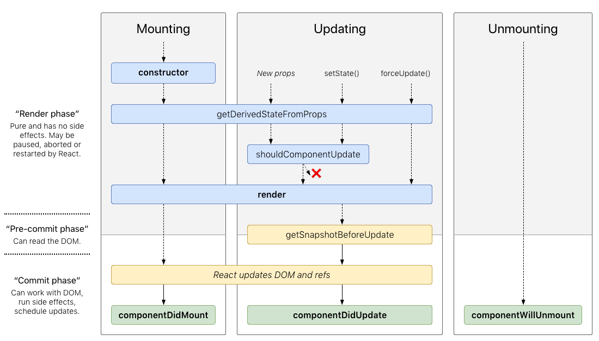

# Lifecycle Methods



Each component has several “lifecycle methods” that you can override to run code at particular times in the process.
In the graph above you can see when each one of them is executed.

They are all divided into 3 basic groups:

- Mounting
- Updating
- Unmounting

## Mounting

These methods are called in the following order when an instance of a component is being created and inserted into the DOM.

### `constructor()`

The constructor for a React component is called before it is mounted. This is the normal `Class` constructor, the only difference is that initial `props` are passed in as the constructors first parameter.

The main use for a components `constructor` is to set an initial state. **This is the only place where you can set state using an assignment, without using `this.setState`.**
 
```jsx harmony
class Component extends React.Component {
    constructor(props) {
      super(props);
      // Don't call this.setState() here!
      this.state = { counter: 0 };
    }
}
```

### `componentDidMount()`

`componentDidMount()` is invoked immediately after a component is mounted (inserted into the tree).
If you need to load data from a remote endpoint, this is a good place to instantiate the network request.

## Updating

An update can be caused by changes to props or state. These methods are called in the following order when a component is being re-rendered:

- `static getDerivedStateFromProps()`
- `shouldComponentUpdate()`
- **`render()`**
- `getSnapshotBeforeUpdate()`
- **`componentDidUpdate()`**

## `render()`

We have already gone over the `render()` method in other lessons. When called, it should examine `this.props` and this.state and return one of the acceptable types that we say in [a previous lesson.](./Render.md)

## `componentDidUpdate()`

`componentDidUpdate()` is invoked immediately after updating occurs. This method is not called for the initial render.
It is called with 3 parameters, `prevProps`, `prevState` and `snapshot`. Inside this method `this.state` and `this.props` refer to the "new" versions of both properties.
We can use these parameters to do network requests, where we can compare previous props to current props.
A common example is to load the new users information if the `id` prop changes.

```jsx harmony
componentDidUpdate(prevProps) {
  // Typical usage (don't forget to compare props):
  if (this.props.id !== prevProps.id) {
    this.fetchData(this.props.id);
  }
}
```
You may call `setState()` immediately in `componentDidUpdate()` but note that it must be wrapped in a condition like in the example above, or you’ll cause an infinite loop.

## Unmounting

Unmounting only has 1 lifecycle method, `componentWillUnmount`, which wil be triggered when a component is removed from the DOM.

### `componentWillUnmount()`

`componentWillUnmount()` is invoked immediately before a component is unmounted and destroyed.
Perform any necessary cleanup in this method, such as invalidating timers, canceling network requests, or cleaning up any subscriptions that were created in `ComponentDidMount()`.

## References

- https://reactjs.org/docs/react-component.html
- http://projects.wojtekmaj.pl/react-lifecycle-methods-diagram/
