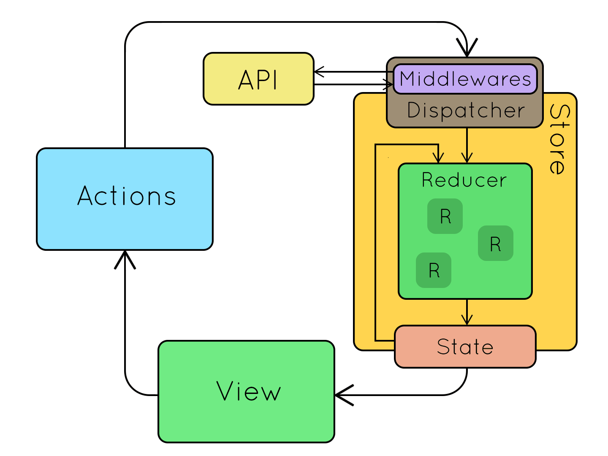

# Redux

Redux is a predictable state container for JavaScript apps.

## History

- Server state
- Persistent state
- The URL and router state
- Client state
- Transient client state
- Local UI state

## When NOT to use Redux

- When state is not complex.
- When your only problem is multi-level communication.
- When side-effects are not problematic.
- When creating a one-time app (most of the time).
- When the only reason you want to use Redux is because someone tells you to.

## Core Concepts

- Single source of truth
- The state of your whole application is stored in an object tree.
- State is read-only
- State is modified through by triggering an action, which is an object describing what happened.
- Changes are made with pure functions
- To specify how the state is transformed by actions you use reducer that calculates the new state based on the old state and the action that was triggered.

## Store

The object is like a model, except in that it cannot be “set” directly.

To change something in the state, you need to dispatch an action.

The Store is the object that brings them together. The store has the following responsibilities:

- Holds application state;
- Allows access to state via getState();
- Allows state to be updated via dispatch(action);
- Registers listeners via subscribe(listener);
- Handles unregistering of listeners via the function returned by subscribe(listener).

example:

```js
const store = {
  todos: [
    {
      text: "Eat food",
      completed: true
    },
    {
      text: "Exercise",
      completed: false
    }
  ],
  visibilityFilter: "SHOW_COMPLETED"
};
```

## Actions

An action is a plain JavaScript object that describes what happened.

Enforcing that every change is described as an action lets us have a clear understanding of what’s going on in the app.

```js
{ type: 'ADD_TODO', text: 'Go to swimming pool' }
{ type: 'TOGGLE_TODO', index: 1 }
{ type: 'SET_VISIBILITY_FILTER', filter: 'SHOW_ALL' }

```

Actions are payloads of information that send data from your application to your store.

You send them to the store using store.dispatch().

Actions must have a type property that indicates the type of action being performed.

```js
const action = {
  type: ADD_TODO,
  text: "Build my first Redux app"
};
store.dispatch(action);
```

**Action Creators**

Functions that create actions

```js
export const ADD_TODO = 'ADD_TODO'
function addTodo(text) {
  return {
    type: ADD_TODO,
    text
  }
}
store.dispatch(addTodo(“My TODO”);
```

## Reducers

It’s a function that takes state and action as arguments, and returns the next state of the app.

It’s composes into smaller functions managing individual parts of the state.

```js
function visibilityFilter(state = "SHOW_ALL", action) {
  if (action.type === "SET_VISIBILITY_FILTER") {
    return action.filter;
  } else {
    return state;
  }
}

function todos(state = [], action) {
  switch (action.type) {
    case "ADD_TODO":
      return state.concat([{ text: action.text, completed: false }]);
    case "TOGGLE_TODO":
      return state.map((todo, index) =>
        action.index === index
          ? { text: todo.text, completed: !todo.completed }
          : todo
      );
    default:
      return state;
  }
}
```

A reducer is a pure function that takes the previous state and an action, and returns the next state.

It has a default state.

It should just be a calculation.

Return state in default case.

```js
import { VisibilityFilters } from "./actions";

const initialState = {
  visibilityFilter: VisibilityFilters.SHOW_ALL,
  todos: []
};

function todoApp(state = initialState, action) {
  switch (action.type) {
    case SET_VISIBILITY_FILTER:
      return Object.assign({}, state, {
        visibilityFilter: action.filter
      });
    default:
      return state;
  }
}
```

Things NOT to do in a reducer:

- Mutate Arguments
- Side effects
- Call non-pure functions
- Mutate State

## Combine reducers

```js
import { combineReducers } from "redux";
import todos from "./todos";
import visibilityFilter from "./visibilityFilter";

export default combineReducers({
  todos,
  visibilityFilter
});
```

## Redux workflow



|                |    Presentational Components     |                           Container Components |
| -------------- | :------------------------------: | ---------------------------------------------: |
| Purpose        | How things look (markup, styles) | How things work (data fetching, state updates) |
| Aware of Redux |                No                |                                            Yes |
| To read data   |          right-aligned           |                       Subscribe to Redux state |
| To change data |   Invoke callbacks from props    |                         Dispatch Redux actions |

## Read from Store

mapStateToProps

```js
const getVisibleTodos = (todos, filter) => {
  switch (filter) {
    case "SHOW_COMPLETED":
      return todos.filter(t => t.completed);
    case "SHOW_ACTIVE":
      return todos.filter(t => !t.completed);
    case "SHOW_ALL":
    default:
      return todos;
  }
};

const mapStateToProps = (state, ownProps) => {
  return {
    todos: getVisibleTodos(state.todos, state.visibilityFilter)
  };
};
```

## Dispatch Actions

mapDispatchToProps

```js
// long notation
const mapDispatchToProps = dispatch => {
  return {
    onTodoClick: id => {
      dispatch(toggleTodo(id));
    }
  };
};

// Shorthand notation
const mapDispatchToProps = {
  onTodoClick: toggleTodo
};
```

## Connect Component to Store

connect

```js
import { connect } from "react-redux";
import { TodoList } from "./components/TodoList";

const mapStateToProps = (state, ownProps) => {
  return {
    todos: getVisibleTodos(state.todos, state.visibilityFilter)
  };
};

const mapDispatchToProps = {
  onTodoClick: toggleTodo
};

const VisibleTodoList = connect(
  mapStateToProps,
  mapDispatchToProps
)(TodoList);

export default VisibleTodoList;
```

## Create the Store

```js
import React from "react";
import { render } from "react-dom";
import { Provider } from "react-redux";
import { createStore } from "redux";
import todoApp from "./reducers";
import App from "./components/App";

const store = createStore(todoApp);

render(
  <Provider store={store}>
    <App />
  </Provider>,
  document.getElementById("root")
);
```

## Async Actions


**Thunks**

Thunks are action creators that return a function instead of an action object.

When an action creator returns a function, that function will get executed by the Redux Thunk middleware.

This function doesn't need to be pure; it is thus allowed to have side effects.

The function can also dispatch actions.

```js
import thunkMiddleware from "redux-thunk";
import { createStore, applyMiddleware } from "redux";
import { selectSubreddit, fetchPosts } from "./actions";
import rootReducer from "./reducers";

// this is the setup for thunks
const store = createStore(
  rootReducer,
  applyMiddleware(
    thunkMiddleware // lets us dispatch() functions
  )
);

/// ....

/// this is a thunk action
export function fetchPosts(subreddit) {
  return function(dispatch) {
    dispatch(requestPosts(subreddit));

    return fetch(`https://www.reddit.com/r/${subreddit}.json`)
      .then(
        response => response.json(),
        error => console.log("An error occurred.", error)
      )
      .then(json => dispatch(receivePosts(subreddit, json)));
  };
}
```

---

Presentation for this unit is available [here.](https://slides.com/linx05/redux-and-state-management)
